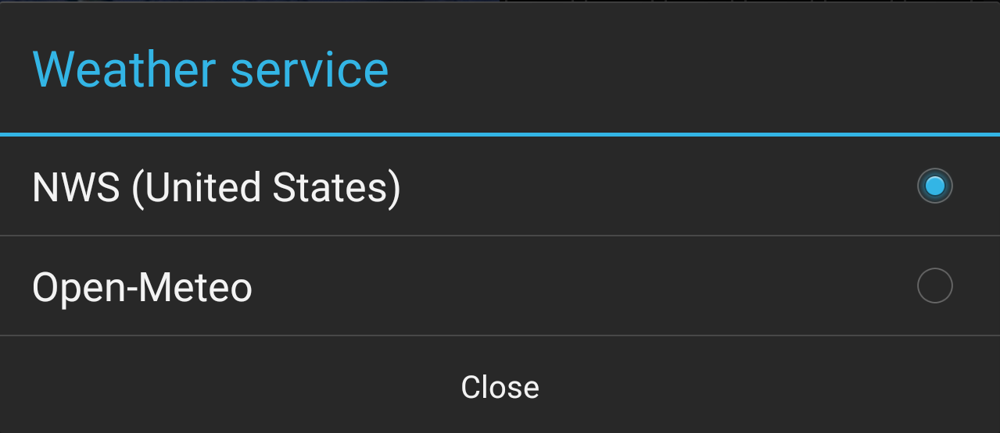
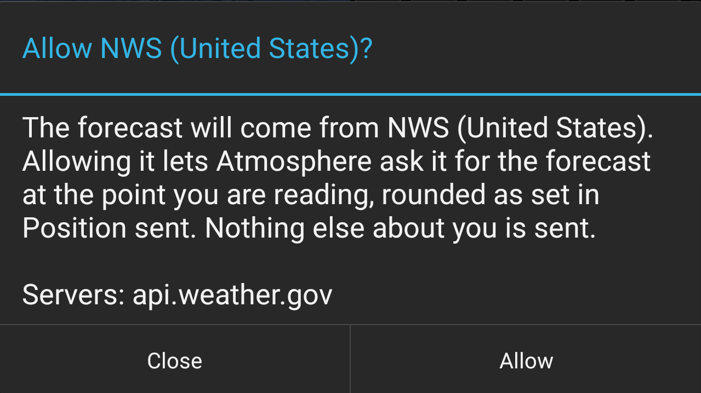

# Atmosphere for ATAK — User Guide

**Version 0.2 · takwerx**

**Download Atmosphere 0.2** (pick the one matching your ATAK-CIV version, sideload, then load it in ATAK's Plugins manager):

- **ATAK-CIV 5.6:** https://github.com/takwerx/atmosphere/releases/download/v0.2/ATAK-Plugin-Atmosphere-0.2--5.6.0-civ-release.apk
- **ATAK-CIV 5.7:** https://github.com/takwerx/atmosphere/releases/download/v0.2/ATAK-Plugin-Atmosphere-0.2--5.7.0-civ-release.apk
- **ATAK-CIV 5.8:** https://github.com/takwerx/atmosphere/releases/download/v0.2/ATAK-Plugin-Atmosphere-0.2--5.8.0-civ-release.apk

All releases: https://github.com/takwerx/atmosphere/releases

Atmosphere is the weather on the ATAK map for fire and hazmat crews: the
forecast at a point, the readings from the weather stations, river gauges and
buoys around you, and the pictures the weather services publish — radar,
satellite, wind, rain, smoke, air quality, fire and flood outlooks, flooding,
waves, the sea and snow — each one a layer you switch on when you need it.

Everything it shows is read by your device from public services and stays on
your device. Nothing is published to a server or to anyone else's map. No layer
talks to the network until you allow it, once, by name.

Warnings, watches and advisories are not here on purpose: they are the
[IPAWS Alerts](https://github.com/takwerx/ipaws-alerts) plugin's job, and the
two are meant to run side by side.

---

## 1. Before you start

- Published builds exist for **ATAK-CIV 5.6, 5.7 and 5.8**. Install the one that
  matches your ATAK exactly; a build for another version will not load.
- The phone needs a network path to the weather services; each layer names its
  server when it first asks to be allowed. A reading that has been fetched stays
  readable when the network drops, with its age on it.
- The first time, the forecast needs a weather service. Open **Forecast
  settings** at the top of the Forecast page, tap **Weather service** and pick
  one — **NWS (United States)** for the US, **Open-Meteo** anywhere else. It asks
  once, naming the server; **Allow** turns it on and reads the forecast.

  

## 2. The pane

Open Atmosphere from the ATAK toolbar, or from Tools if it is not on the bar.
The pane opens at half width. The top row is the same on every page:

- **My position**, **Map center** and **Pick a point** choose the point every
  reading is for; the one in use is green.
- The star is **Favorites**: places kept by name.
- **Units** switches every number between US, metric and aviation units.
- **Full size** makes the pane full width and back; at full size every button
  has its name under it.
- The arrows step through the pages; the page name between them opens a list of
  all six.

 

The six pages are **Forecast**, the readout for a point; **Layers**, every map
layer with its switch and settings; **Spots**, the open spot forecast requests;
and **Stations**, **Gauges** and **Buoys**, the ones around you as lists. Back
closes the pane, or narrows a full-size one first.

## 3. The forecast

The first page is the readout for one point: your position, the map center, a
point you tap on the map, or a favorite. The top line names the point and how
old the reading is.

- **Now**: temperature, humidity, the 20-foot wind and where it is from, gusts,
  mixing height, transport wind, wet bulb globe temperature and the chance of
  rain; under them the sky cover, sunrise, sunset and the moon. An element the
  forecast office does not issue says so.
- **Next hours**: the next day and a half as a line, one value at a time; the
  buttons under it pick which. **Show hourly table** opens the whole table.
- **Next days**: each day's high and low, lowest humidity, strongest wind and
  gust, and highest chance of rain.

 

**Refresh** at the top of this page reads the forecast again. **Forecast
settings** beside it picks the **Weather service** the forecast comes from,
lists the **Allowed services**, **What to show**, and **Position sent** — how
coarsely your position is rounded before it leaves the device. **Favorites**
keeps places by name.

 

## 4. The layers

The second page lists every layer under a heading for what it is about: spot
forecasts and weather stations at the top, then **Wind**, **Fire**, **Rain and
rivers**, **Ocean** and **Snow**. Each row is a switch that shows its state —
green ON, red OFF — with the layer's icon beside it. **All on** and **All off**
switch every allowed layer at once.

A layer that is ON grows an arrow at the end of its row; tap it for the layer's
settings, its map key, and a status line that says what is on the map and what
is not — "zoom in to see", "drawn for the middle of the map", "no storms right
now".

The first time a layer is switched on it asks once, naming the server it will
talk to and what is sent: the area of the map, never your position, unless the
layer says so. **Allow** remembers the answer.

Every layer that draws on the map is a row inside one **Atmosphere** row in
ATAK's Overlay Manager, each with its own icon, where it can be hidden without
opening the plugin.

 

| Group | Layer | What it draws |
|---|---|---|
| | Spot forecasts | Every open spot forecast request, with the office's forecast behind a tap |
| | Weather stations | The stations around you, wind barb and readings, colored against the Red Flag criteria for their zone |
| Wind | Radar | The NWS radar mosaics over the US, Environment Canada's over Canada, and RainViewer's composite of the world's public radars everywhere else, whichever the map is over, with a time scrubber |
| Wind | Satellite | The newest GOES picture, infrared (day and night) or visible; reaches the open ocean where no radar does |
| Wind | Rain | The model's rain rate, light to violent, hour by hour for five days with the rate "Here"; a forecast, not radar |
| Wind | Wind | The forecast wind as moving streaks colored by speed, with a time scrubber, heights to the jet stream, and the wind "Here" |
| Fire | Fire weather outlook | Elevated, critical and extreme areas and dry thunderstorms, Day 1, 2, 3 or all; from Day 3 as a chance of critical |
| Fire | Smoke | Forecast smoke at the ground or through the whole sky, with the amount "Here" |
| Fire | Air quality | The EPA's air quality areas and the index "Here" |
| Rain and rivers | Flash flood outlook | Excessive rainfall areas for three days, marginal to high |
| Rain and rivers | River gauges | Gauges colored by flood category; stage, flow and hydrograph behind a tap |
| Rain and rivers | Flooded ground | Where the river model puts water over the banks, now or at the worst of the next 5 days (experimental) |
| Rain and rivers | Streams running high | Stream stretches over their high-water mark, colored by how rare the flow is; the numbers behind a tap |
| Ocean | Buoys | Buoys and coastal stations, readings colored by sea state; tides, currents and the marine forecast behind a tap |
| Ocean | Waves | The wave forecast: seas colored by state, the swell as moving crests, five days on the time strip, with the seas "Here" |
| Ocean | Beach forecast | Beach areas colored by rip current risk |
| Ocean | Sea temperature | Sea surface temperature as a picture |
| Ocean | Hurricanes | Active storms: track, cone, wind fields, advisory |
| Snow | Avalanche | Forecast zones by danger rating, travel advice behind a tap |
| Snow | Snow stations | Mountain snow stations: depth, water equivalent, temperature |
| Snow | Snow depth | The daily snow analysis as a picture |

## 5. What the layers look like

<table>
<tr><td> Radar over the Northeast</td>
<td> Radar over Mexico and Central America, from RainViewer</td></tr>
<tr><td> Satellite, infrared: a hurricane's eye at sea</td>
<td> Wind around the same hurricane</td></tr>
<tr><td> Rain, the model's forecast, where no radar reaches</td>
<td> Fire weather outlook, Day 2 Elevated</td></tr>
<tr><td> Smoke at the ground</td>
<td> Flash flood outlook, Day 2</td></tr>
<tr><td> Flooded ground along a river at major flood</td>
<td> Streams running high on the same river</td></tr>
<tr><td> Waves: sea state and swell</td>
<td> Hurricanes: track and cone</td></tr>
<tr><td> Beach forecast: rip current risk</td>
<td> Weather stations with wind and humidity</td></tr>
</table>

## 6. Stations, gauges and buoys as lists

The **Stations**, **Gauges** and **Buoys** pages list what their layers draw,
nearest first from your position or the map center, out to the distance you
pick. The filters at the top say what each will show, with a count, before you
tap. A star keeps one as a favorite, and a favorite stays on the map and in the
list however far away you go. **Go to** frames one on the map; tapping a row
opens the whole record.

 

- A station's record: every reading, its fire weather zone and the Red Flag
  criteria for it, and the station's own page.
- A gauge's record: stage and flow now, the flood stages, and the observed and
  forecast hydrograph for the last day to the last month.
- A buoy's record: its readings and the sea state they mean, the nearest tide
  station's highs and lows, the nearest current station's ebb and flood, and
  the coastal or offshore waters forecast for the water it sits in.

 

Two settings per layer decide when things draw: at this zoom or closer for the
markers, and for their readings. **Use this zoom** takes what the scale bar
reads now; **Always** never hides them.

## 7. Spot forecasts

The layer draws every spot forecast request the National Weather Service has
open, with the forecast the office wrote for each. The page lists them — All,
Near me, On map, by State or by Region — and a search box finds one by incident
name. Tap a request for its forecast.

 

**Request a spot forecast** prepares yours: pick the point — My position, Map
center, Pick on map, a Favorite, or an Address — and the plugin copies it in the
form the Weather Service's web form takes. Open the form, hold its USNG box,
paste, and press Plot USNG. An address is looked up by the US Census Bureau
first; you see what came back before it is used.

 

## 8. The user manual

The manual is inside the plugin. Open ATAK's **Settings**, then **Tool
Preferences**, **Specific Tool Preferences**, **Atmosphere**, and tap
**Atmosphere user manual**.

## 9. What it does not do

- It draws no warnings, watches or advisories. IPAWS Alerts does.
- It publishes nothing: no path puts anything on another phone or a server.
- It records nothing about you: no callsign, device identifier or TAK server
  detail is ever sent. Your position leaves the device only for the forecast
  you ask for, rounded as coarsely as you set, and for the station, gauge and
  buoy lists when they are set to My position.
